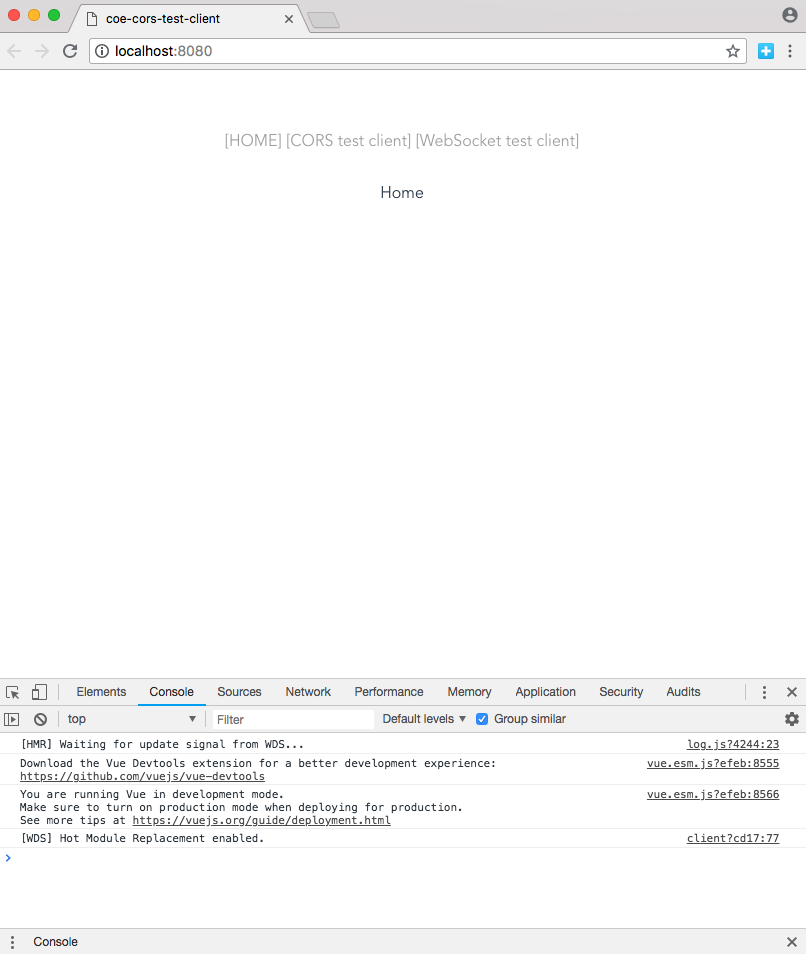
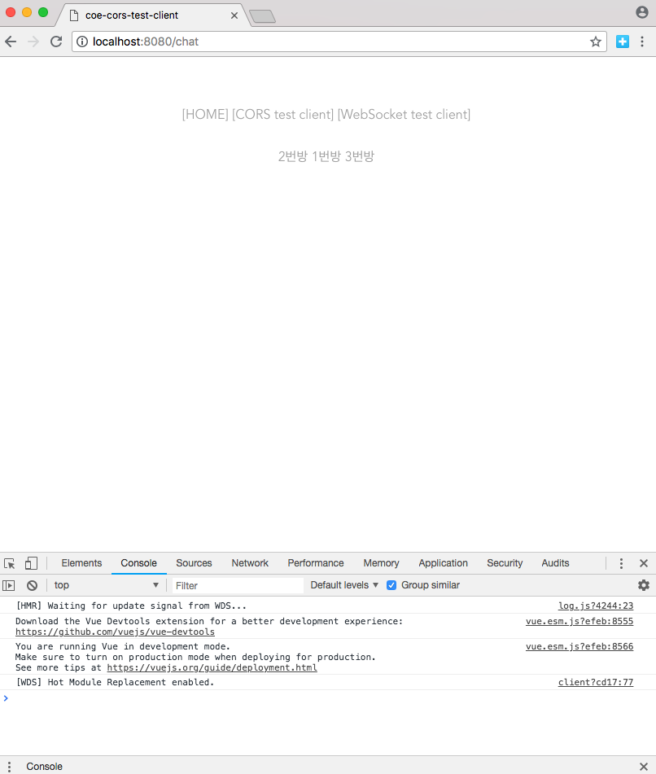
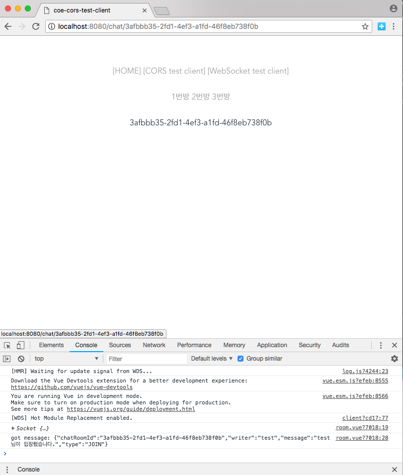

# COE Chat Service
Websocket을 사용한 체팅 서버 어플리케이션
- 7997 PORT 사용
- spring-boot-starter-websocket 사용
    ```xml
    <dependency>
        <groupId>org.springframework.boot</groupId>
        <artifactId>spring-boot-starter-websocket</artifactId>
    </dependency>
    ```

# Getting started
```sh
$ git clone https://github.com/SDSACT/coe-chat-service.git
$ cd coe-chat-service
$ ./mvnw clean install
$ java -jar -Dspring.profiles.active=local ./target/chat-service-0.0.1-SNAPSHOT.jar
```

# Run with
- [Chatting client](https://github.com/SDSACT/coe-cors-test-client)
- [Netflix Eureka](https://github.com/SDSACT/coe-eureka)
- [Spring Cloud Gateway](https://github.com/SDSACT/coe-spring-cloud-gateway)

# Usage
1. install &  run chatting client

2. select Websocket test and chetting room


